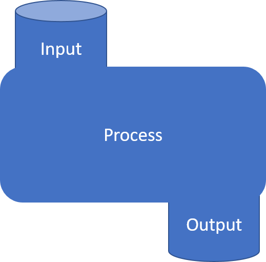
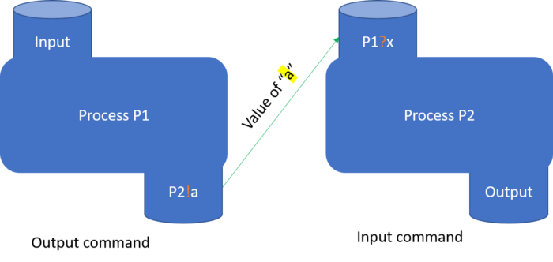

### CSP (Communicating Sequential Processes)

Multiprocessor machines are powerfull and in roder to use such machine effectively on a single task, the component processors must be able to communicate and to synchronize with each other. Many methods of archieving this have been proposed. A widely adopted method of communication is by using "shared memory". However, this can create severe problems in the construction of correct programs. A greater variety of methods has been proposed for synchronization: sempahores, events, conditional critical sections, monitors and queues. Most of these are demonstrably adequate for their purpose.

Go's aproach for concurrency is based on CSP (Communicating Sequential Processes), which is a formal language for describing patterns of interaction in concurrent systems. The CSP solve concurrency through two primitives of programming: input and output. In CSP, processes are any individual logic that needs input to run and produce output. 

Multiple concurrent processes area llowed to synchronize (communicate via named sources and destinations) with each other by synchronizing their I/O. In the formal CSP language there are two commands that specify communication between two concurrently processes.

**!** for sending input to a process

`lineprinter!lineimage` means: to `lineprinter`, send the value of `lineimage`.

**?** for reading the output from a process

`cardreader?cardimage` means: from `cardreader`, read a card and assign its value to the variable `cardimage`.

The main concept CSP describe is Synchronization and Guarded command.

#### Synchronization

Communication occurs between two processes whenever:

- An `input command` in one process specifies as its source the process' name of the other process.;
- An `output command` in the other process specifies as its destination the process' name of the first process;
- The target variable of the `input command` matches the value denoted by the expression of the `output command`.

On the above conditions, the input and output commands are said to correspond. Commands which correspond are executed simultaneously, and their combined effect is to assign the value of the expression of the output command to the target variable of the input command.

An input command fails if its source is terminated. An outpur command fails if its destination is terminated or if its expression is undefined.

The requirement of synchronization of input and output commands means that an implementation will have to delay whichever of the two commands happens to be ready first. The delay is ended when te corresponding command in other process is also ready, or when the other process terminates. It is also possible that the delay will never be ended, for example, if a group of processes are attempting to communicate but none of their input and output commands coorrespond with each other, then a deadlock occurs.

In above example of synchronization:

- `process P1` output value fo `a` via output command (**!**) to `process P2`;
- `process P2` inpout value from `process P1` via input command (**?**) and assign it to `x`;

#### Guarded command

Guarded command is a statement of the form `G -> S`, where `G` is a boolean expression and `S` is the statement whose execution is controlled by `G`.

Notation: **->**

`*[c:character; west?c -> east!c]`

The above example means: read all characters output by `west`, and output them one by one to `east`. The repetition terminates when the process `west` terminates.

#### Go
