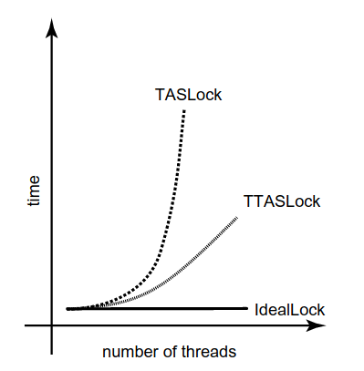

### locks

In mutual exclusion problems, when you can't acquire the lock there are two alternatives.

- If you keep trying, the lock is called a `spin lock`, and repeatedly testing the lock is called `spinning`, or `busy-waiting`. Spinning is sensible when you expect the lock delay to be short.
- The alternative is to suspend yourself and ask the operating system's scheduler to schedule another thread on your processor, which is sometimes called `blocking`. Because switching from one thread to another is expensive, blocking makes sense only if you expect the lock delay to be long.

### Welcome to real world

When programming our multiprocessor, we naturally assumed that read-write operations are atomic, that is, they are linearizable to some sequential execution, or at very least, that they are sequentially consistent.

Sequential consistency implies that there is some global order on all operations in which each thread's operations take effect as ordered by its program.  We relied on the assumption that memory is sequentially consistent when proving the Peterson lock correct.

Our proof that the Peterson lock provided mutual exclusion implicitly relied on the assumption that any two memory accesses by the same thread, even to separate variables, take effect in program order. Unfortunately, modern multiprocessors typically do not provide sequentially consistent memory, nor do they necessarily guarantee program order among read-writes by a given thread.

### Why not?

- There are compilers that reorder instructions to enhance performance. Most programming languages preserve program order for each individual variable, but not across multiple variables;
- Writes to multiprocessor memory do not necessarily take effect when they are issued, because in most programs the vast majority of writes do not need to take effect in shared memory right away. Thus, on many multiprocessor architectures, writes to shared memory are buffered in a special `write buffer`, to be written to memory only when needed.

To prevent the reordering of operations resulting from write buffering, modern architectures provide a special `memory barrier` instruction that forces outstanding operations to take effect. It is programmer's responsibility to know where to insert a memory barrier, because they are expensive, and we want to minimize their use. In Java one way to use a memory barrier is by using the keyword `volatile`.

### Test and Set Locks

The `testAndSet` instruction operates on a single memory word, which holds a binary value. The instruction atomically stores `true` in the word, and returns that word's previous value, swapping the value `true` for the word's current value.

The instruction seems ideal for implementing a spin lock. The lock is free when the word's value is `flase`, and busy when it is `true`. The `lock` method repeatedly applies `testAndSet` to a location until that instruction returns `false`. The `unlock` method simply writes the value `false` to it.

#### TAS vs. TTAS

In the directories `locks/tas-lock` and `locks/ttas-lock` we have the implementation of the algorithms TAS and TTAS, respectively. You might think there is no difference between them, but experiments (on a real multiprocessor) that measure the elapsed time for N threads to execute a short critical section invariably yield the following results.

The top curve is the TASLock, the middle curve is the TTASLock, and the bottom curve shows the time that would be needed if teh threads did not interfere at all. The difference is dramatic: the TASLock performs very poorly, and the TTASLock performance, while substantially better, still falls far short of teh ideal. These differences can be explained in terms of modern multiprocessor architectures.

##### Multiprocessors Architecture

For simplicity, we consider a typical multiprocessor architecture in which processors communicate by a shared broadcast medium called `bus`. Both the processors and the memory controller can broadcast on the `bus`, but only one processor (or memory) can broadcast at a time. All processors (and memory) can listen. Each processor has a cache, a small high-speed memory where the processor keeps data likely to be interest.

When a processor reads from an address in memory, it first checks whether that address and its contents are present in its cache. If so, then the processor has a `cache hit`, and can load the value immediately. If not, then the processor has `cache miss`, and must find the data either in the memory, or in another processor's cache. The processor then broadcasts teh address on the bus. The other processors snoop on the bus. If one processor has that address in its cache, then it responds by broadcasting teh address and value. If no processor has that address, then the memory itself responds with the value at that address.

#### TAS-Based spin locks

##### TAS Lock

We now consider how the TASLock performs on a shared-bus architecture. Each `getAndSet` call is broadcast on the bus. Because all threads must use the bus to communicate with memory, these `getAndSet` calls delay all threads, even those not waiting for the lock. Even worse, the `getAndSet` call forces other processors to discard their own cached copies of the lock, so every spinning thread encounters a `cahce miss` almost every time, and must use the bus to fetch the new but unchanged value (unchanged because if a thread is spinning, every `getAndSet` call will set the value of the lock to `true`, but it already was `true`). Adding insult to injury, when the thread holding the lock tries to release it, it may be delayed because the bus is monopolized by the spinners. We now understand why the TASLock performs so poorly.

##### TTAS Lock

Now consider the behavior of teh TTASLock while the lock is held by a thread A. The first time thread B reads the lock it takes a `cache miss`, forcing B to block while the value is loaded into B's cache. As long as A holds the lock, B repeatedly rereads the value, but hits in the cache every time. B thus produces no bus traffic, and does not slow down the other threads' memory accesses. Moreover, a thread that releases a lock is not delayed by threads spinning on that lock.
